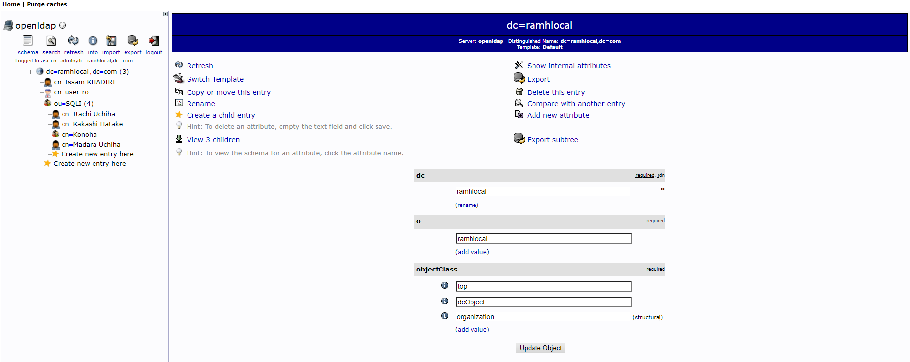
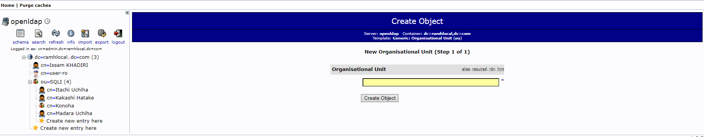
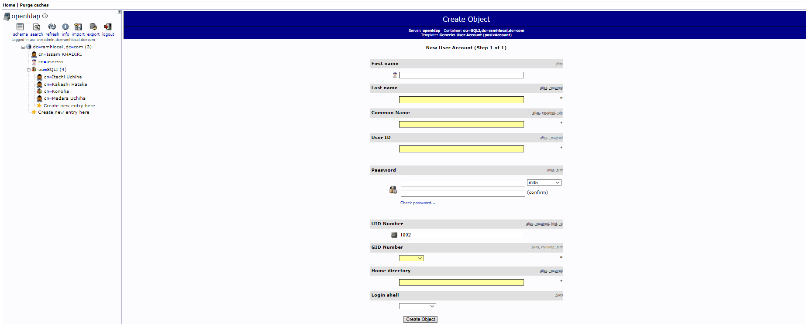
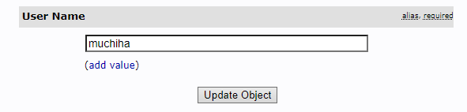

# Uploading file architecture


# local URLs:
## Application homepage
* http://localhost:8000/

## Elasticsearch
* http://localhost:9292/

## PHPMyAdmin
* http://localhost:8080/
> root / superSec3t

## Graylog
* http://localhost:9001/ 
> admin / admin

## Opensearch
* http://localhost:9200/

## Mailcatcher
* http://localhost:1080/

## RabbitMQ
* http://localhost:15672/
> guest / guest

## Mongo Express
* http://localhost:8081/ : Mongo Express 
> dmin / pass

## LDAP
* PHP LDAP ADMIN: http://localhost:8082
> cn=admin,dc=ramhlocal,dc=com  / admin_pass

-- Documentations: 
Create users / Organizations

### Home


### Create new Organization Unit


### Create new User Account

> for the password, i used the CLEAR option

For things to work, I wanted to add some other attributes (like in source/config/packages/security.yaml).
 see 
```security.providers.ldap_user_provider.ldap.extra_fields```

To connect user, I used the uid (user name)


