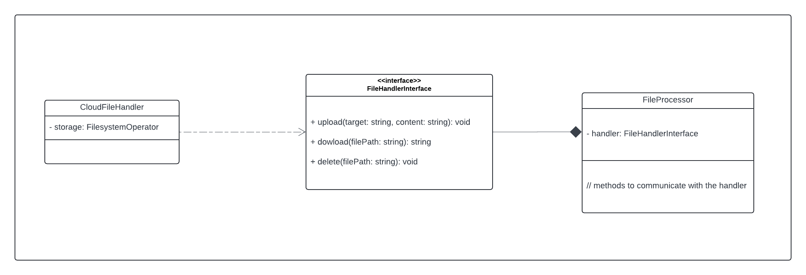

# Uploading file architecture

# local URLs:
## Application homepage
* http://localhost:8000/

## Elasticsearch
* http://localhost:9292/

## PHPMyAdmin
* http://localhost:8080/
> root / superSec3t

## Graylog
* http://localhost:9001/ 
> admin / admin

## Opensearch
* http://localhost:9200/

## Mailcatcher
* http://localhost:1080/

## RabbitMQ
* http://localhost:15672/
> guest / guest

## Mongo Express
* http://localhost:8081/ : Mongo Express 
> dmin / pass